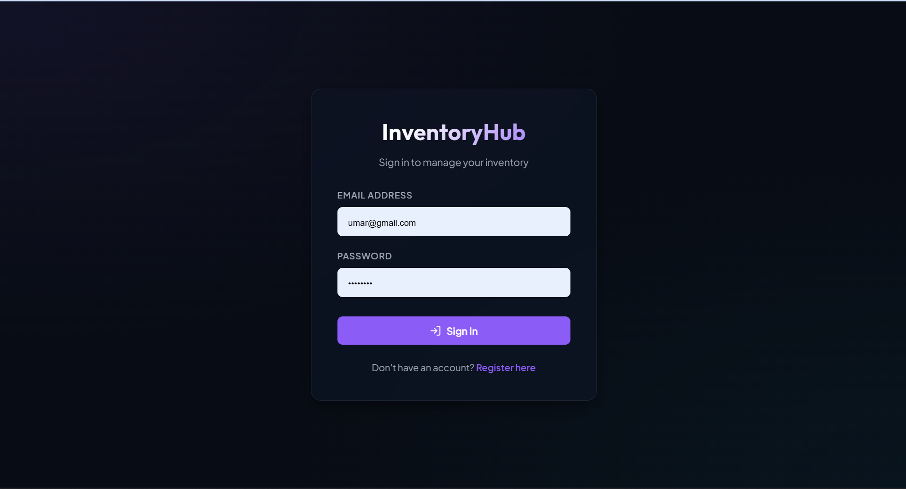
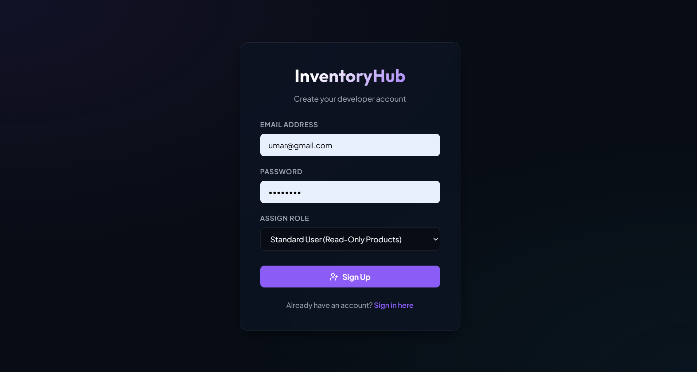

# InventoryHub - Production-Grade Inventory Management System

InventoryHub is a highly scalable, secure, and modular full-stack application built for real-time inventory tracking and product management. It employs a Spring Boot backend, a PostgreSQL database, JWT-based stateless authentication, Role-Based Access Control (RBAC), and a responsive React frontend with premium dark-mode styling.

---

## 💻 Tech Stack

### Backend
* **Java 21**
* **Spring Boot 3.4.1**
* **Spring Security** (Stateless JWT Authentication & Authorization)
* **Spring Data JPA**
* **PostgreSQL**
* **Lombok** (v1.18.40 for JDK 25 compiler compatibility)
* **Hibernate Validator** (Bean Validation)
* **Springdoc OpenAPI (Swagger UI)**

### Frontend
* **React 19**
* **Vite** (Next-generation frontend tooling)
* **Axios** (API requests with automatic JWT interceptors)
* **React Router DOM v7**
* **Lucide React** (Modern layout iconography)
* **Custom Vanilla CSS** (Responsive premium glassmorphic dark design)

---

## 🚀 Key Features

* **JWT Stateless Authentication**: Secure registration and login flows using BCrypt password hashing.
* **Role-Based Access Control (RBAC)**:
  * `ADMIN`: Can perform full product CRUD (Create, Read, Update, Delete).
  * `USER`: Can view products only (Read-Only).
* **Robust Input Validation**: Strict validation on the model layer (e.g. `@NotBlank`, `@Positive`, `@Min`, `@Email`).
* **Centralized Exception Handler**: CENTRAL unified error JSON structure across all API exceptions (including validation, not found, forbidden, unauthorized, and server errors).
* **API Documentation**: Interactive Swagger-UI documentation mapping all endpoints.
* **Automated Data Seeding**: Automatically seeds default roles (`ROLE_USER` and `ROLE_ADMIN`) and test users (admin and standard user) on database initialization.

---

## 📂 Project Structure

```text
InventoryHub/
├── InventoryHub.postman_collection.json  # Exported Postman collection
├── README.md                             # Project documentation
├── client/                               # Frontend React Application
│   ├── package.json
│   ├── vite.config.js
│   ├── src/
│   │   ├── main.jsx                      # React entry script
│   │   ├── App.jsx                       # Routing setup
│   │   ├── App.css
│   │   ├── index.css                     # Premium dark theme stylesheets
│   │   ├── components/
│   │   │   ├── ProtectedRoute.jsx        # Navigation security guards
│   │   │   └── Sidebar.jsx               # Dynamic navigation layout
│   │   ├── context/
│   │   │   └── AuthContext.jsx           # Global JWT & Axios state
│   │   └── pages/
│   │       ├── Login.jsx                 # Login screen
│   │       ├── Register.jsx              # Sign-up screen with role select
│   │       ├── Dashboard.jsx             # Metric cards
│   │       ├── ProductList.jsx           # Interactive products table
│   │       ├── AddProduct.jsx            # Create item forms
│   │       └── EditProduct.jsx           # Edit item forms
└── server/                               # Backend Spring Boot Service
    ├── pom.xml
    ├── src/
    │   ├── main/
    │   │   ├── java/com/adnanumar/server/
    │   │   │   ├── ServerApplication.java # Spring Boot entry
    │   │   │   ├── config/               # Security & Swagger configs
    │   │   │   │   ├── DatabaseInitializer.java
    │   │   │   │   ├── OpenApiConfig.java
    │   │   │   │   └── SecurityConfig.java
    │   │   │   ├── constant/             # Global Roles Enum
    │   │   │   ├── controller/           # REST Controllers
    │   │   │   ├── dto/                  # Request / Response DTOs
    │   │   │   ├── entity/               # JPA Entities
    │   │   │   ├── exception/            # Central Exceptions & Advice
    │   │   │   ├── mapper/               # DTO <-> Entity maps
    │   │   │   ├── repository/           # JPA Database interfaces
    │   │   │   └── security/             # JWT Filter & JWT utility class
    │   │   └── resources/
    │   │       └── application.yaml      # Database connection & credentials
```

---

## 🛠️ Database Setup

InventoryHub requires a PostgreSQL database instance running.

1. Connect to your PostgreSQL server:
   ```bash
   psql -U postgres
   ```
2. Create the target database:
   ```sql
   CREATE DATABASE inventoryhub_db;
   ```
3. Default database connection configurations are located inside [application.yaml](file:///d:/AllProgram/InternShala/InventoryHub/server/src/main/resources/application.yaml):
   ```yaml
   spring:
     datasource:
       url: jdbc:postgresql://localhost:5432/inventoryhub_db
       username: postgres
       password: password
   ```
   *Modify credentials in this file if your local PostgreSQL details differ.*

---

## 🏃 Running the Application

### Running Backend
1. Open a terminal inside the `server` directory:
   ```bash
   cd server
   ```
2. Build and compile the project using Maven:
   ```bash
   mvn clean compile
   ```
3. Run the Spring Boot application:
   ```bash
   mvn spring-boot:run
   ```
4. The server will launch on port `8080` (base URL: `http://localhost:8080`).

#### API Swagger Documentation:
Once running, you can access the Swagger-UI page at:
**[http://localhost:8080/swagger-ui/index.html](http://localhost:8080/swagger-ui/index.html)**

### Running Frontend
1. Open a terminal inside the `client` directory:
   ```bash
   cd client
   ```
2. Start the Vite React development server:
   ```bash
   npm run dev
   ```
3. The application will start on port `5173`. Open your browser and navigate to:
   **[http://localhost:5173](http://localhost:5173)**

---

## 🐳 Docker Hub CI/CD

The repository includes a GitHub Actions workflow at [.github/workflows/dockerhub-cicd.yml](.github/workflows/dockerhub-cicd.yml) that builds and pushes both images to Docker Hub on every push to `main` and on manual dispatch.

Create these GitHub repository secrets before enabling the workflow:

* `DOCKERHUB_USERNAME`
* `DOCKERHUB_TOKEN`

The workflow publishes these image names:

* `DOCKERHUB_USERNAME/inventoryhub-client:latest`
* `DOCKERHUB_USERNAME/inventoryhub-client:<commit-sha>`
* `DOCKERHUB_USERNAME/inventoryhub-server:latest`
* `DOCKERHUB_USERNAME/inventoryhub-server:<commit-sha>`

The frontend reads its API URL from [client/.env](client/.env), which currently points to `http://localhost:8080` for local development.

---

## 👥 Seeded Test Credentials

During backend startup, the database is auto-seeded with test users. You can sign in using:

1. **Administrator Account (Full Read/Write CRUD)**:
   * **Email**: `admin@inventoryhub.com`
   * **Password**: `adminpassword`

2. **Standard User Account (Read-Only Products)**:
   * **Email**: `user@inventoryhub.com`
   * **Password**: `userpassword`

---

## 📌 API Endpoints List

All endpoints are versioned under `/api/v1/`.

| Category | HTTP Method | Endpoint | Description | Role Required |
|---|---|---|---|---|
| **Auth** | `POST` | `/api/v1/auth/register` | Register a new account | Public |
| **Auth** | `POST` | `/api/v1/auth/login` | Authenticate and get JWT | Public |
| **Products** | `GET` | `/api/v1/products` | Retrieve all products | `USER` or `ADMIN` |
| **Products** | `GET` | `/api/v1/products/{id}` | Fetch a product by ID | `USER` or `ADMIN` |
| **Products** | `POST` | `/api/v1/products` | Create a new product | `ADMIN` |
| **Products** | `PUT` | `/api/v1/products/{id}` | Update product details | `ADMIN` |
| **Products** | `DELETE` | `/api/v1/products/{id}` | Remove product from inventory | `ADMIN` |

---

## 📈 Microservice Scalability Discussion

To transition this monolithic architecture into a distributed microservice system, we recommend implementing the following components:

### 1. Caching with Redis
* **State**: Cache product details (especially `GET` requests like `/api/v1/products`) using Redis to reduce database read bottlenecks.
* **Mechanism**: Use Spring Boot Starter Cache with `@Cacheable` and configure eviction policies (`@CacheEvict`) on write operations (`POST`, `PUT`, `DELETE`).

### 2. API Gateway
* **State**: Introduce a **Spring Cloud Gateway** to act as a single entry point for all client requests.
* **Benefits**: Route requests to appropriate services, handle cross-cutting concerns (such as CORS, rate limiting, and global request logging), and centralize authentication checks.

### 3. Service Discovery
* **State**: Use **Netflix Eureka** or Consul for service registry.
* **Benefits**: Individual services (Auth Service, Product Service) register themselves dynamically. The API Gateway queries Service Discovery to load balance and route traffic to active instances, preventing hardcoded service URLs.

### 4. Load Balancing
* **State**: Use **Spring Cloud LoadBalancer** (integrated with Eureka) or container orchestrators (like Kubernetes Service load balancers).
* **Benefits**: Distributes traffic evenly among replica containers of Auth/Product services.

### 5. Docker Deployment
* **State**: Containerize both services and database using Dockerfiles and compose them.
* **Docker Compose Example**:
  ```yaml
  version: '3.8'
  services:
    postgres-db:
      image: postgres:15
      ports:
        - "5432:5432"
    auth-service:
      build: ./auth-service
      ports:
        - "8081:8081"
    product-service:
      build: ./product-service
      ports:
        - "8082:8082"
  ```

### 6. CI/CD Readiness
* **State**: Configure automated pipelines using GitHub Actions, GitLab CI, or Jenkins.
* **Pipeline steps**: Compile and run unit/integration tests (`mvn clean test`), run static code analysers (SonarQube), build Docker images, push to container registries, and auto-deploy to staging environments (e.g. AWS ECS, GCP GKE).

---

## 📸 Screenshots

*Screenshots from the frontend are stored in `client/public/ss` and rendered below:*

| Login | Sign Up |
|---|---|
|  |  |

| Dashboard | Products Grid |
|---|---|
|  |  |
